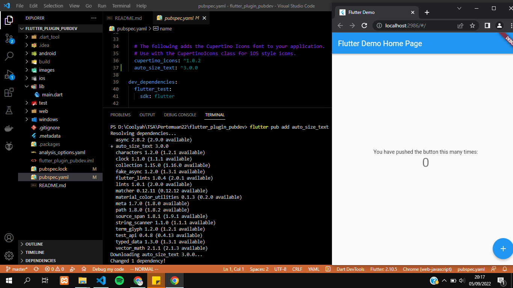
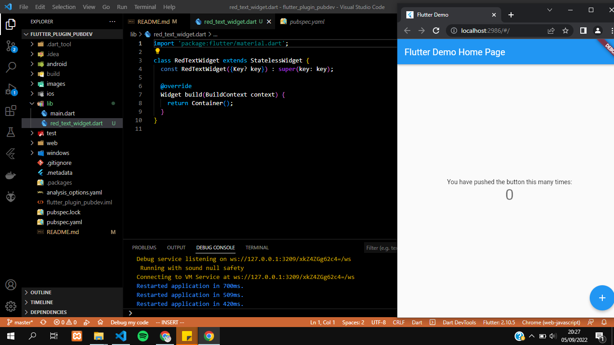
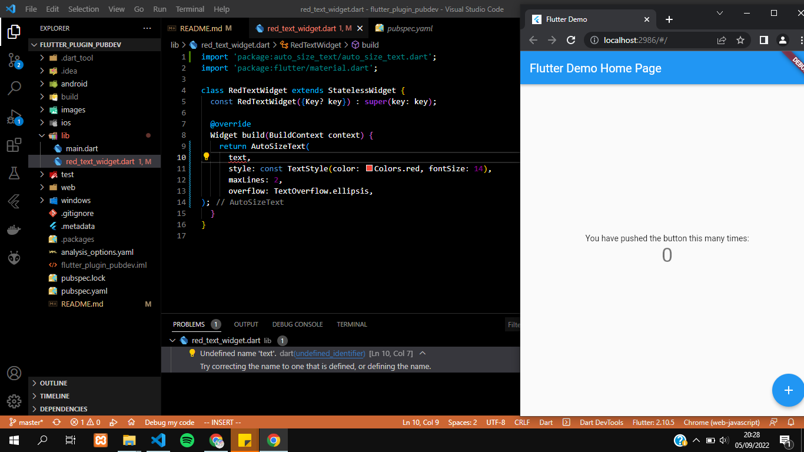
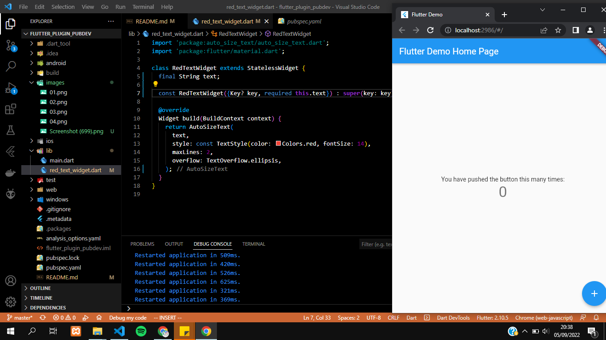
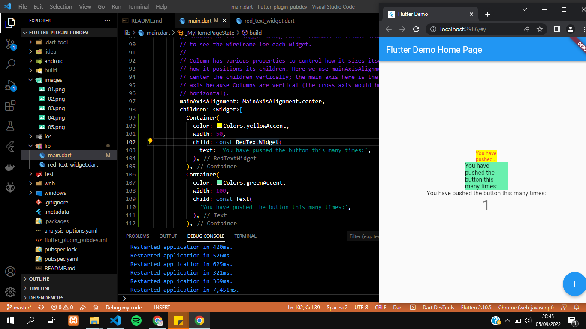

# flutter_plugin_pubdev

A new Flutter project.

## Langkah 1: Buat Project Baru
Membuat projek flutter baru dengan nama flutter_plugin_pubdev


## Langkah 2: Menambahkan Plugin
Menambahkan plugin auto_size_text, menggunakan perintah "flutter pub add auto_size_text". Jika plugin berhasil ditambahaknan maka pada file pubspec.yaml bagian dependencies akan muncul nama dan versi dari plugin. Pada projek ini menggunakan versi 3.0.0


## Langkah 3: Buat file red_text_widget.dart
Membuat file baru pada folder lib dengan nama red_text_widget.dart.


## Langkah 4: Tambah Widget AutoSizeText
Untuk menggunakan plugin auto_size_text, maka perlu untuk merubah kode return Container() menjadi seperti berikut.
```
return AutoSizeText(
      text,
      style: const TextStyle(color: Colors.red, fontSize: 14),
      maxLines: 2,
      overflow: TextOverflow.ellipsis,
);
```

Hasil dari penambahan code tersebut akan terjadi error. Hal tersebut dikarenakan variabel text belum didefinisikan pada class RedTextWidget.

## Langkah 5: Buat Variabel text dan parameter di constructor
Untuk menghilangkan error pada langkah 4 maka perlu menambahkan variabel text dan menambahkan parameter pada constructor sebagai berikut:
```
final String text;

const RedTextWidget({Key? key, required this.text}) : super(key: key);
```


## Langkah 6: Tambahkan widget di main.dart
Menambahkan dua widget berikut pada file main.dart
```
Container(
   color: Colors.yellowAccent,
   width: 50,
   child: const RedTextWidget(
	text: 'You have pushed the button this many times:',
	),
),
Container(
    color: Colors.greenAccent,
    width: 100,
    child: const Text(
	'You have pushed the button this many times:',
	),
),
```
- Widget pertama menggunakan RedTextWidget, hasilnya yaitu tulisan yang meimliki background berwarna kuning
- Untuk widget kedua hanya menggunakan text saja, hasilnya yaitu tulisan yang memiliki background berwarna hijau
